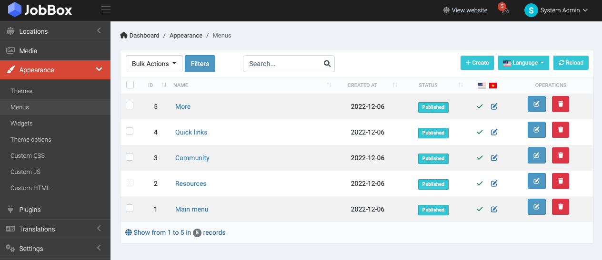
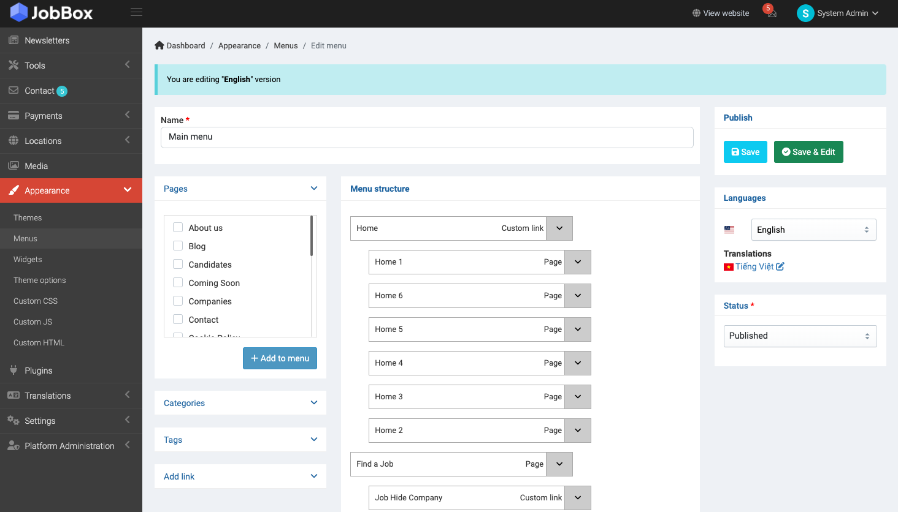
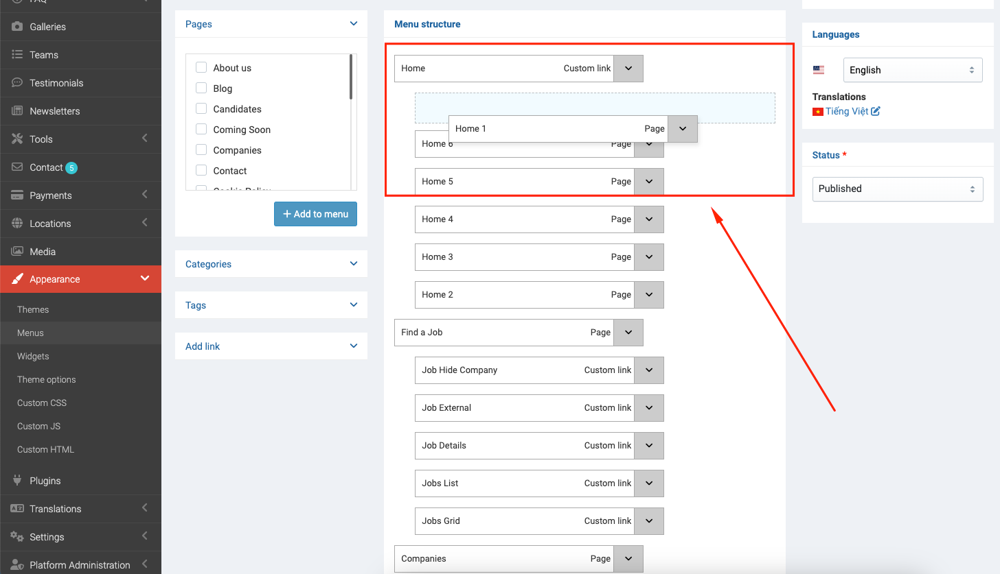
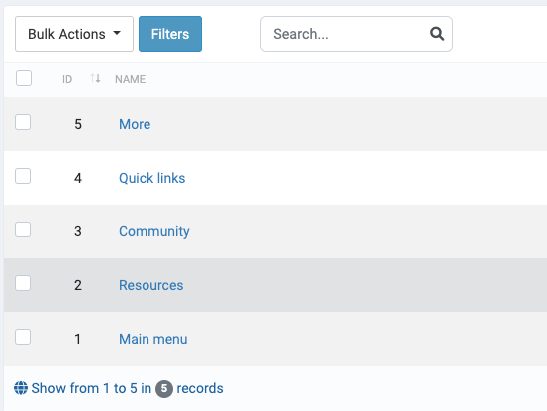

# Setup Menus

Menus can be customized at `Admin` -> `Appearance` -> `Menus`.

## Main Menu

You can customize the main menu by click to **Main Menu** at the **Menus** page.

You also can change the menu position by drag and drop it.

## Other Menus

There are have many other menus on the JobBox that you can customize such as:

- More
- Quick links
- Resources
- Community

