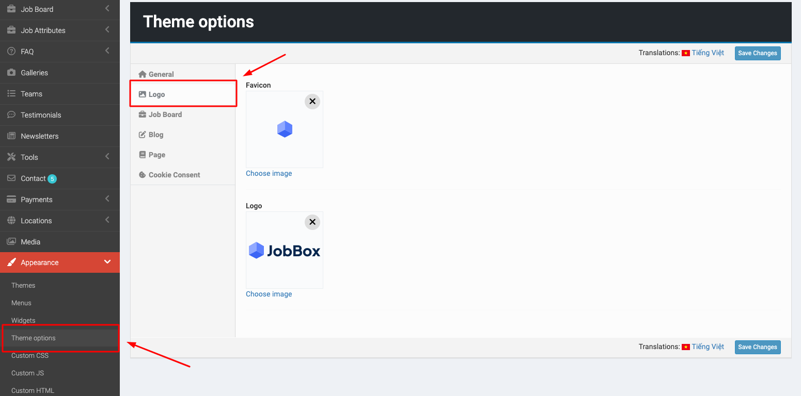
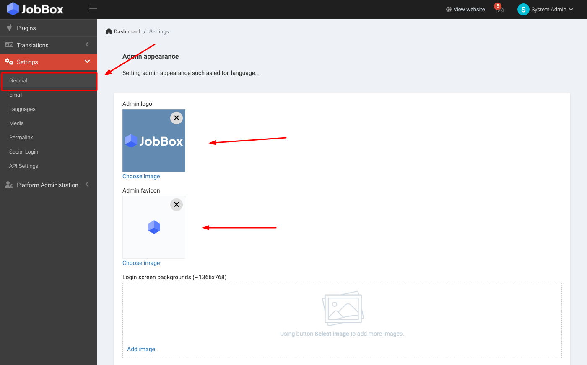
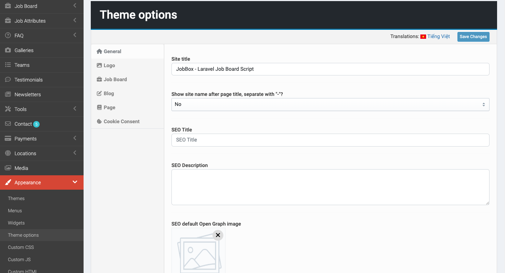
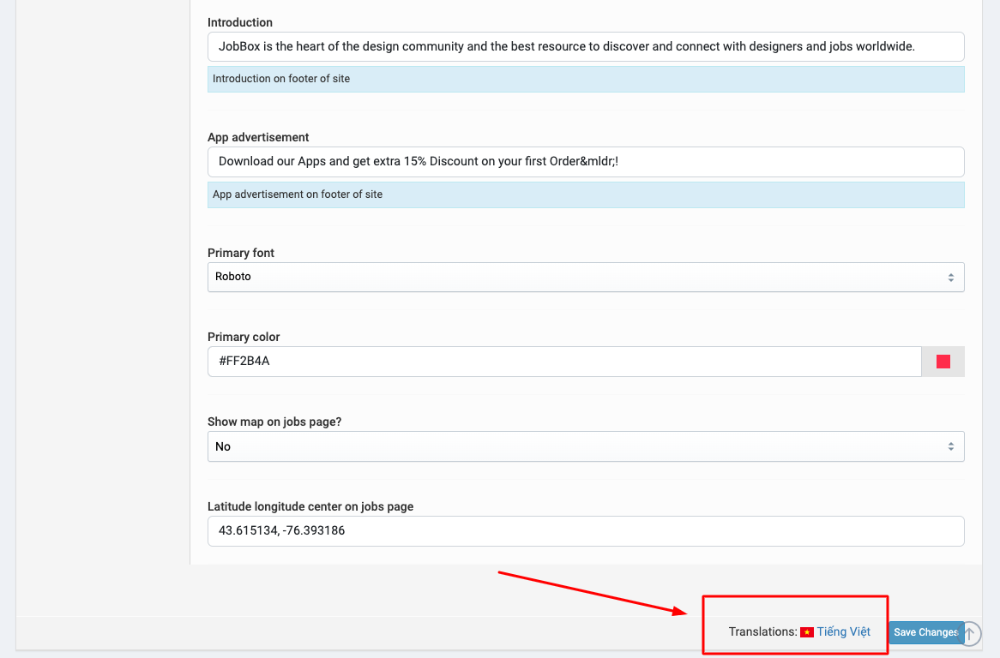
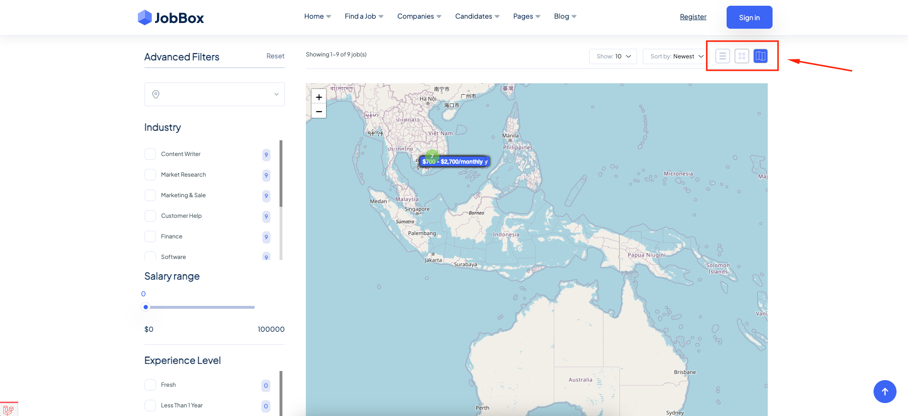
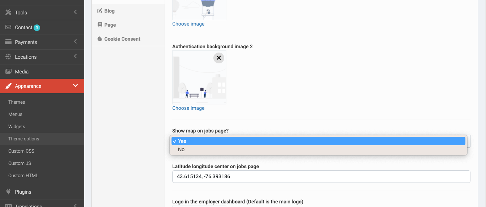

# Setup Theme

Go to `Admin` -> `Appearance` -> `Theme options`.

You can customize your theme at here, such as like: site information, logo, theme styles, ...

## Favicon & Logo

To change front theme logo & favicon, At the **Theme options** page, click to **Logo** tab, you can update your own logo & favicon.

To change admin logo & favicon, go to `Admin` -> `Settings` -> `General`.

## Site information

In the **General** tab, you can edit title, description, ... of your site.

Click to your language on the right side if you want to set up theme options in other language.

## Job List page

Job list page has three layouts: grid, list and map.

You can enable/disable the map layout in **Job Board** tab in **Theme options**.

