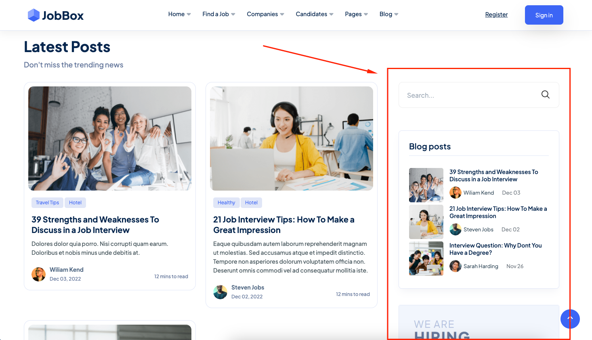
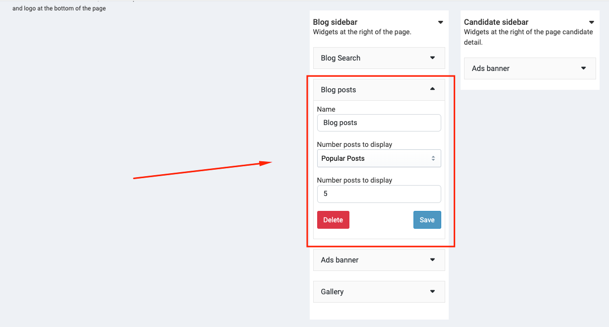
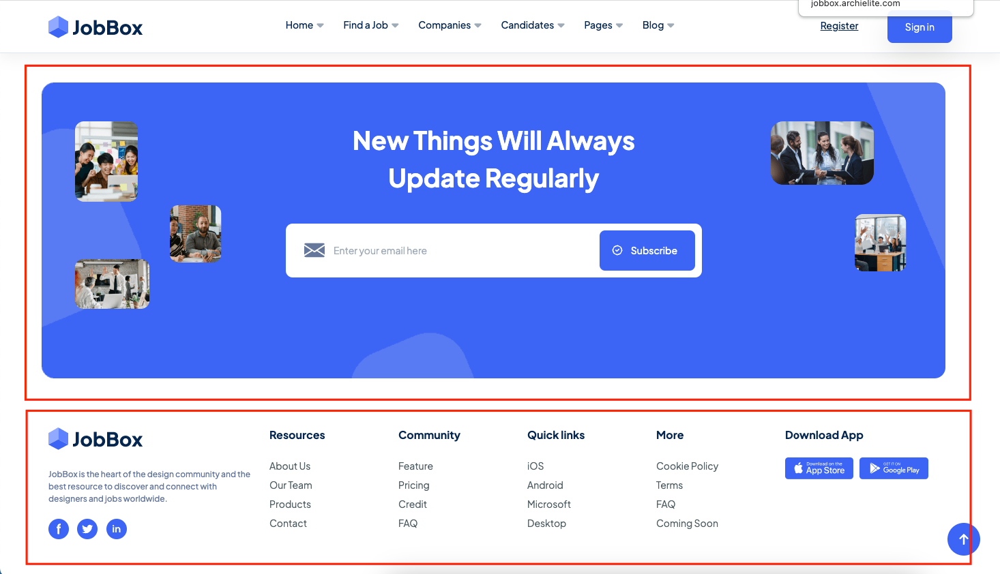
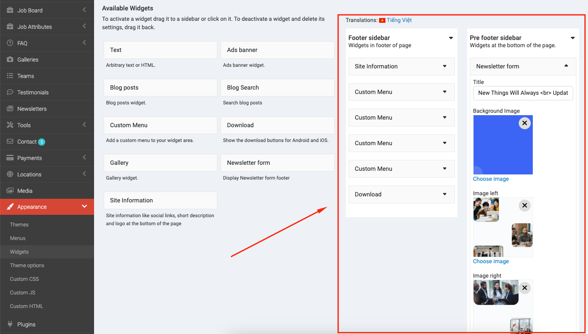
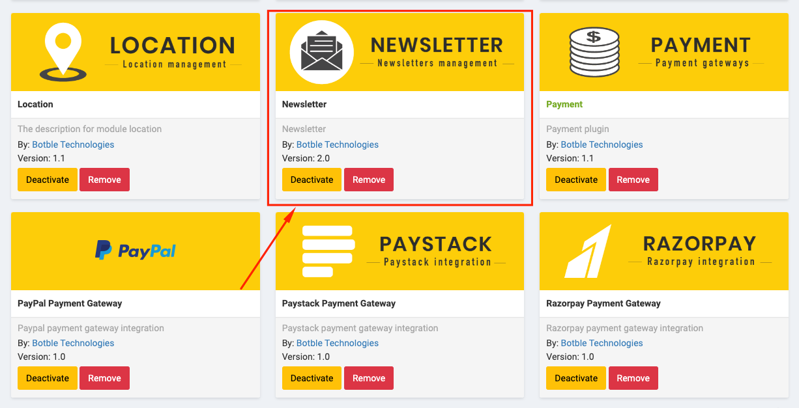

# Widgets

You can customize widgets in `Admin` -> `Appearance` -> `Widgets`.

## Blog sidebar

## Footer

The footer have some widgets like `Newsletter form`, `Site information`, `Download` and `Custom Menu`.

:::tip
If you don't need to use the **Newsletter widgets**, you can deactivate it in `Admin` -> `Plugins` and click
to **Deactivate** button on **Newsletter** card.
:::

